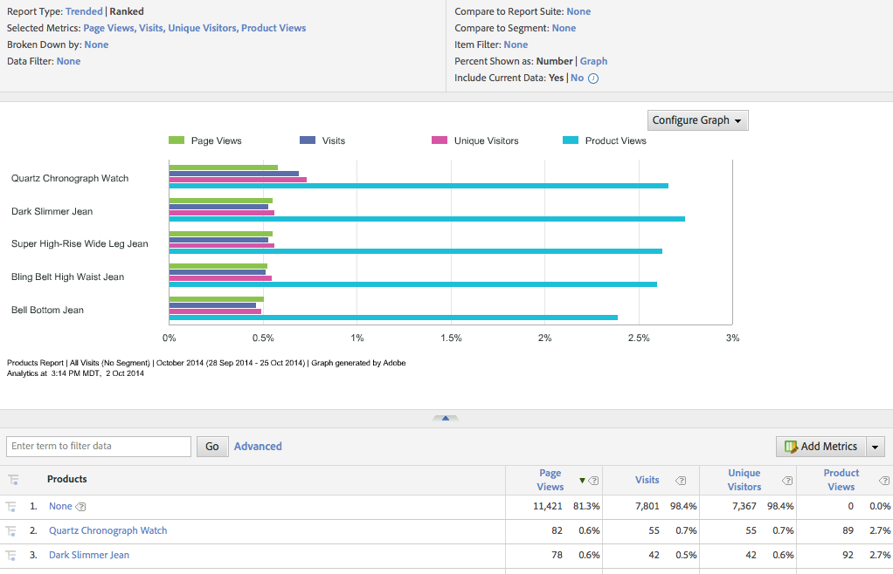

# Demo Application

All of the articles and tutorials in this series are based on Adobe’s JJ. Esquire demo application \(www.jjesquire.com\).

An earlier article of this series, Analytics JavaScript Tagging Tutorial, walks you through the steps of adding Analytics JavaScript Tagging code to four pages in the simplified JJ. Esquire demo application.

As visitors browse the web site, the tagging code submits page view information, event details and other online analytics data to the Adobe Data Collection Layer where it is incorporated into the JJ. Esquire web site’s reporting suite data. For instance, the following report shows the number of times these products have been viewed by visitors:

Note that this product detail page presents users with two possible actions, or events: Add to Cart or Purchase by Phone.

You can track the revenue associated with the Add to Cart event through the JJ. Esquire web site, but the revenue for the Purchase by Phone event is part of an external, offline system. Since this offline revenue would be useful to have in Analytics reports for comparison against online revenue, you can upload it directly to the Adobe Experience Cloud using the Data Sources API.

In this article, you will batch upload the date, product SKU, transaction ID and revenue associated with the Purchase by Phone event. The product SKU and transaction ID will associate the offline revenue to the appropriate product in the existing data set. Remember that the transaction ID you use here is the same one you created in the Tagging article. The transaction ID acts as a key between the offline and online events.

**Parent topic:** [Data Sources API Tutorial](c_Data_Sources_Overview.md)

